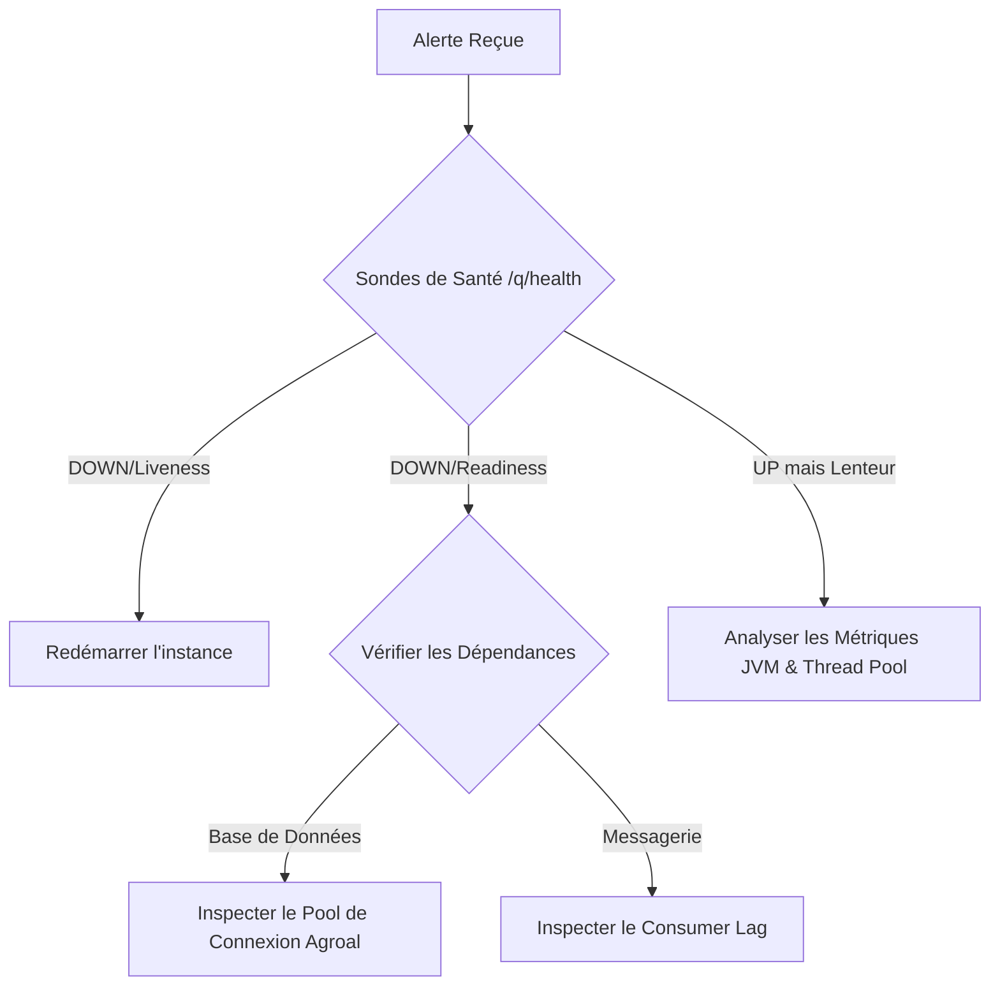

# La Taverne en Flammes : arrêt gracieux, résilience et plan de reprise avec Quarkus

La Taverne "The Falling Whale" a résisté aux assauts des orcs, géré les flux massifs de clients grâce au réactif, et sécurisé ses chambres avec Vaadin. Mais que se passe-t-il quand le pire survient ? Un incendie se déclare dans les cuisines, la fumée envahit la salle, et tout menace de s'effondrer.

Ce module n'ajoute pas une fonctionnalité de plus. Il traite de l'ultime épreuve d'une architecture logicielle : **comment mourir proprement, sauver ce qui peut l'être, et renaître de ses cendres.**

Chaque mécanisme décrit ci-dessous est implémenté et déclenchable à la main via l'API : on met le feu, on regarde les sondes tomber, on lit le runbook, puis on rédige le post-mortem.

---

## Démarrer

```bash
./mvnw quarkus:dev -pl operations/la-taverne-en-flammes
```

L'application écoute sur le port **8086**. Aucun broker ni base externe n'est nécessaire : la persistance utilise H2 en mémoire et la volière un canal in-VM.

| Ressource | URL |
| :--- | :--- |
| Swagger UI | http://localhost:8086/q/swagger-ui |
| Santé globale | http://localhost:8086/q/health |
| Liveness / Readiness | http://localhost:8086/q/health/live · http://localhost:8086/q/health/ready |
| Métriques Prometheus | http://localhost:8086/q/metrics |

---

## 1. L'arrêt gracieux (Graceful Shutdown)
*La métaphore : Laisser les aventuriers finir leur chope et évacuer calmement avant de verrouiller les portes.*

Si vous éteignez brutalement le serveur (un simple `kill -9`), les clients qui attendaient leur plat vont se retrouver face à une connexion rompue, et les transactions en cours risquent d'être corrompues.

Quarkus propose un mécanisme d'**arrêt gracieux**. À la réception d'un `SIGTERM`, il laisse un délai aux requêtes déjà en cours pour se terminer proprement avant de couper.

### Configuration dans [application.properties](src/main/resources/application.properties)

```properties
# Temps accorde aux requetes en cours avant l'arret force de l'application
quarkus.shutdown.timeout=30s

# Sas de pre-arret : l'application sert encore, mais la readiness repond DOWN
quarkus.shutdown.delay-enabled=true
quarkus.shutdown.delay=3s
```

> **Deux propriétés, deux rôles distincts — et un piège.**
> `quarkus.shutdown.timeout` attend la fin des requêtes en cours, mais **continue d'accepter les nouvelles** pendant ce temps. Pour arrêter d'en recevoir, il faut le sas de pré-arrêt : `quarkus.shutdown.delay` fait passer la readiness à `DOWN` pendant que l'application sert encore, le temps que l'orchestrateur la sorte du routage.
> Le piège : **`delay` est purement ignoré si `delay-enabled` n'est pas explicitement à `true`**. C'est écrit dans la javadoc de la propriété, et c'est très facile à manquer.

### La démonstration

[`SalleCommuneService`](src/main/java/fr/eletutour/tavern/flammes/arret/SalleCommuneService.java) sert des tournées volontairement lentes et compte celles encore en vol. [`ArretGracieuxObserver`](src/main/java/fr/eletutour/tavern/flammes/arret/ArretGracieuxObserver.java) observe le `ShutdownEvent` pour tracer ce qu'il reste à faire.

```bash
# Terminal 1 : lancer une tournee de 15 secondes
curl "http://localhost:8086/taverne/salle/tournees?aventurier=Grimgor&secondes=15"

# Terminal 2 : envoyer un SIGTERM pendant le service
kill -TERM $(jcmd | grep quarkus-run | cut -d' ' -f1)
```

Chronologie observée sur un `SIGTERM` reçu pendant une tournée de 6 secondes :

```
t+0,0s   SIGTERM
t+0,1s   readiness -> 503, mais les requetes metier sont encore servies (sas de 3s)
t+3,0s   GracefulShutdownFilter : "Waiting for HTTP requests to complete"
t+5,0s   la tournee lancee avant le SIGTERM repond 200 apres ses 6 secondes pleines
t+6,8s   "la-taverne-en-flammes stopped in 6.824s"
```

La tournée n'a pas été coupée. Avec `kill -9`, la connexion serait tombée à `t+0`.

---

## 2. Le guichet de sécurité (Readiness et Liveness)
*La métaphore : Le panneau à l'entrée de la taverne. La Liveness dit si la taverne tient debout. La Readiness dit si on peut encore y entrer pour commander.*

Dans un orchestrateur comme Kubernetes (ou avec un reverse-proxy), il est vital de savoir si l'application est en bonne santé.

* **Liveness (Est-on vivant ?)** : si le fil d'exécution principal est bloqué ou si la JVM est en Out Of Memory, la taverne s'est effondrée. L'orchestrateur doit détruire l'instance et en démarrer une nouvelle.
* **Readiness (Est-on prêt à servir ?)** : si la cuisine brûle ou si la base de données ne répond plus, la taverne tient encore debout (Live), mais elle ne peut plus accepter de clients (Not Ready). L'orchestrateur doit la retirer du routage pour ne pas envoyer d'aventuriers dans une impasse.

### Implémentation de la sonde de Readiness

[`CaveABiereHealthCheck`](src/main/java/fr/eletutour/tavern/flammes/sante/CaveABiereHealthCheck.java) :

```java
@Readiness
@ApplicationScoped
public class CaveABiereHealthCheck implements HealthCheck {

    @Inject
    IncendieService incendieService;

    @Override
    public HealthCheckResponse call() {
        EtatTaverne etat = incendieService.etat();
        boolean accesCaveOk = !etat.cuisineEnFeu();

        return HealthCheckResponse.named("Acces a la reserve de biere")
            .status(accesCaveOk)
            .withData("temperature_cave", accesCaveOk ? "12 C" : "68 C")
            .withData("escalier_praticable", accesCaveOk)
            .withData("origine_incendie", etat.origineIncendie())
            .build();
    }
}
```

Son pendant [`CharpenteHealthCheck`](src/main/java/fr/eletutour/tavern/flammes/sante/CharpenteHealthCheck.java) porte l'annotation `@Liveness` : c'est le seul cas où l'instance doit être détruite plutôt que réparée à chaud.

### La démonstration

```bash
# La cuisine prend feu : la readiness tombe, la liveness reste UP
curl -X POST "http://localhost:8086/taverne/incendie?origine=friture%20de%20gobelin"
curl -i http://localhost:8086/q/health/ready   # 503, status DOWN
curl -i http://localhost:8086/q/health/live    # 200, status UP

# La charpente cede : la liveness tombe, l'instance n'est plus recuperable
curl -X POST http://localhost:8086/taverne/incendie/effondrements
curl -i http://localhost:8086/q/health/live    # 503

# Retour a la normale
curl -X DELETE http://localhost:8086/taverne/incendie
```

`GET /q/health/ready` renvoie un statut global `DOWN` dès que l'accès à la cave est bloqué, ce qui retire automatiquement l'instance du trafic. La réponse porte aussi l'origine de l'incendie dans `data`, exploitable directement par l'exploitant.

---

## 3. Timeouts et Annulations
*La métaphore : Ne pas laisser un aventurier attendre son plat au milieu des flammes. S'il n'est pas servi en 2 secondes, on annule et on le guide vers la sortie.*

Laisser des requêtes s'éterniser consomme des threads et des ressources précieuses, accélérant l'asphyxie du serveur.

### Avec Mutiny (programmation réactive)

[`CuisineService`](src/main/java/fr/eletutour/tavern/flammes/cuisine/CuisineService.java) fixe une limite stricte à l'attente et définit une issue de secours :

```java
public Uni<Repas> commanderRepas(String plat, long dureePreparationMs) {
    return preparerPlatAsynchrone(platDemande, dureePreparationMs)
        .ifNoItem().after(timeoutCuisine)
        .failWith(() -> new TimeoutException("La cuisine est surchargee !"))
        .onFailure().recoverWithItem(() -> Repas.secours(platDemande));
}
```

```bash
curl "http://localhost:8086/taverne/cuisine/commandes?plat=ragout&preparationMs=100"
# {"plat":"ragout","statut":"SERVI",...}

curl "http://localhost:8086/taverne/cuisine/commandes?plat=cuissot%20de%20dragon&preparationMs=2500"
# {"plat":"Pain et Eau","statut":"SECOURS",...}
```

### Avec MicroProfile Fault Tolerance (déclaratif)

Pour les appels synchrones vers un grimoire externe, [`GrimoireService`](src/main/java/fr/eletutour/tavern/flammes/grimoire/GrimoireService.java) protège les threads de l'application :

```java
@Timeout(value = 1500, unit = ChronoUnit.MILLIS)
@Retry(maxRetries = 1, delay = 100, delayUnit = ChronoUnit.MILLIS)
@Fallback(fallbackMethod = "recetteDeSecours")
public Recette recupererRecette(String nom) {
    return new Recette(platDemande, grimoireDistant.recuperer(platDemande),
        Recette.ORIGINE_GRIMOIRE, grimoireDistant.tentatives());
}
```

Le champ `tentatives` de la réponse rend le `@Retry` visible : `1` quand tout va bien, `2` après une nouvelle tentative.

```bash
# Nominal : un seul appel, recette du grimoire
curl "http://localhost:8086/taverne/grimoire/recettes?nom=tourte"
# {"origine":"GRIMOIRE","tentatives":1,...}

# En panne : une nouvelle tentative, puis la recette de memoire
curl -X PUT "http://localhost:8086/taverne/grimoire/pannes?active=true"
curl "http://localhost:8086/taverne/grimoire/recettes?nom=tourte"
# {"origine":"MEMOIRE_DU_CHEF","tentatives":2,...}

# Trop lent : le @Timeout coupe avant que le thread ne soit immobilise
curl -X PUT "http://localhost:8086/taverne/grimoire/pannes?active=false"
curl -X PUT "http://localhost:8086/taverne/grimoire/latences?ms=3000"
curl "http://localhost:8086/taverne/grimoire/recettes?nom=tourte"
# {"origine":"MEMOIRE_DU_CHEF",...}
```

Les valeurs des annotations sont surchargeables par configuration, ce dont profitent les tests :

```properties
fr.eletutour.tavern.flammes.grimoire.GrimoireService/recupererRecette/Timeout/value=300
```

---

## 4. Vidange des Corbeaux Messagers (Draining)
*La métaphore : Arrêter d'envoyer de nouveaux corbeaux dans la fumée, et finir de lire ceux qu'on a déjà en main.*

Lors d'un arrêt gracieux, il ne suffit pas de couper le serveur HTTP. Si vous consommez des messages, vous devez couper l'arrivée proprement :
1. **Désactivation de la réception** : arrêter de récupérer de nouveaux enregistrements.
2. **Traitement du lot en cours** : finaliser les messages déjà récupérés dans les buffers en mémoire.
3. **Commit des offsets** : valider auprès du broker les messages effectivement traités avant l'extinction.

Avec le connecteur **Kafka** de SmallRye Reactive Messaging, ces trois étapes sont prises en charge de manière transparente par le cycle de vie de Quarkus : au signal d'arrêt, le connecteur ferme le consumer, attend que le pipeline Mutiny se vide, commite les derniers offsets, puis libère les ressources. Les enregistrements non encore récupérés restent sur le topic et seront relus au redémarrage.

### La démonstration, et sa limite

Pour rester exécutable sans broker, ce module utilise un **canal in-VM** ([`VoliereService`](src/main/java/fr/eletutour/tavern/flammes/corbeaux/VoliereService.java) et [`ColombierListener`](src/main/java/fr/eletutour/tavern/flammes/corbeaux/ColombierListener.java)). Le colombier lit les plis lentement, ce qui permet de constituer un retard visible — l'équivalent local d'un *consumer lag*.

Mais **un canal in-VM n'a ni broker ni offset** : ce qui reste dans les buffers à l'arrêt est simplement perdu. Il faut donc retenir explicitement l'arrêt, ce que fait l'observateur de `ShutdownEvent` :

```java
// Quarkus a deja attendu la fin des requetes HTTP. Les plis, eux, ne sont pas suivis par
// le serveur HTTP : c'est ici qu'on retient l'arret le temps de les finir.
long plisPerdus = voliereService.attendreVidange(delaiVidange);
```

C'est précisément ce que le modèle d'offsets de Kafka vous évite d'écrire. Pour la version avec un vrai broker, voir le module [Corbeaux messagers (Kafka)](../../integration/messaging/kafka-tutorial).

```bash
curl -X POST "http://localhost:8086/taverne/voliere/lachers?nombre=40"
curl http://localhost:8086/taverne/voliere
# {"corbeauxLaches":40,"corbeauxTraites":6,"corbeauxEnVol":34}

kill -TERM $(jcmd | grep quarkus-run | cut -d' ' -f1)
```

Extrait du journal d'arrêt :

```
Fermeture des portes : tourneesEnCours=0, corbeauxEnVol=9, delaiAccorde=30s
Vidange terminee : tous les plis recuperes ont ete lus
Salle vide et voliere vidangee : la taverne peut fermer sereinement
```

Si le délai `taverne.voliere.vidange-max` est trop court, l'observateur trace le nombre de plis perdus au lieu de fermer en silence.

---

## 5. Persistance et Sauvegarde
*La métaphore : Sauver le Grand Livre des Comptes de la taverne en le jetant dans le coffre-fort ignifugé.*

Pour qu'aucune transaction ne soit perdue ou à moitié écrite dans l'incendie, Quarkus s'appuie sur le gestionnaire de transactions JTA (Narayana). [`GrandLivreService`](src/main/java/fr/eletutour/tavern/flammes/comptes/GrandLivreService.java) expose les trois cas.

### Les règles d'or de la persistance sous les flammes

**1. Atomicité** — délimiter chaque transaction critique avec `@Transactional`. Soit tout le grimoire est mis à jour, soit rien ne l'est.

```bash
# Nominal : la tournee et la taxe de guilde, dans la meme transaction
curl -X POST "http://localhost:8086/taverne/grand-livre/ecritures?aventurier=Grimgor&montant=30"
curl http://localhost:8086/taverne/grand-livre   # 2 lignes

# Une poutre tombe entre les deux ecritures : JTA annule tout
curl -X DELETE http://localhost:8086/taverne/grand-livre
curl -X POST "http://localhost:8086/taverne/grand-livre/ecritures-interrompues"
curl http://localhost:8086/taverne/grand-livre   # [] : aucune ligne a moitie ecrite
```

**2. Transaction Timeout** — si la base est ralentie par l'incident, la transaction ne doit pas bloquer indéfiniment les verrous SQL.

```properties
# Timeout par defaut des transactions (en secondes)
quarkus.transaction-manager.default-transaction-timeout=10
```

Et au cas par cas, avec `@TransactionConfiguration` :

```java
@Transactional
@TransactionConfiguration(timeout = 2)
public void enregistrerTourneeLente(String aventurier, int montantPiecesOr, long attenteMs) { ... }
```

```bash
curl -X POST "http://localhost:8086/taverne/grand-livre/ecritures-lentes?attenteMs=500"   # 204
curl -X POST "http://localhost:8086/taverne/grand-livre/ecritures-lentes?attenteMs=3000"  # 503
```

> **Détail utile pour le mapping d'erreur** : le `Transaction Reaper` de Narayana annule la transaction depuis son propre thread. L'échec ne remonte donc pas là où le code s'exécute, mais **au commit**, sous la forme d'une `RollbackException` enveloppée dans une `ArcUndeclaredThrowableException`. C'est pour cela que [`GlobalExceptionMapper`](src/main/java/fr/eletutour/tavern/flammes/resource/error/GlobalExceptionMapper.java) parcourt la chaîne de causes plutôt que de faire un simple `switch` sur le type de l'exception reçue.

---

## 6. Runbook d'Incident : Quand le tocsin sonne
*La métaphore : La cloche d'alarme de la taverne résonne. Quelle trappe ouvrir, dans quel ordre ?*

Lorsque l'alerte Prometheus est déclenchée, l'exploitant doit suivre un plan d'action standardisé pour diagnostiquer l'incendie :



Ce diagramme est implémenté par [`RunbookService`](src/main/java/fr/eletutour/tavern/flammes/exploitation/RunbookService.java), qui interroge les sondes puis descend vers la dépendance qui bloque :

```bash
curl http://localhost:8086/taverne/exploitation/runbook
```

```json
{
  "liveness": "UP",
  "readiness": "DOWN",
  "branche": "DOWN/Readiness",
  "tourneesEnCours": 0,
  "voliere": { "corbeauxLaches": 0, "corbeauxTraites": 0, "corbeauxEnVol": 0 },
  "lignesGrandLivre": 0,
  "actions": [
    "Verifier la dependance en cause via GET /q/health/ready",
    "Inspecter le pool de connexions Agroal (vendor_agroal_active_count sur /q/metrics)",
    "Controler le retard de la voliere (equivalent du consumer lag Kafka)",
    "Une fois la cause traitee : POST /taverne/incendie/extinctions"
  ]
}
```

Le service appelle directement les beans `HealthCheck` — et non les endpoints HTTP — pour que le diagnostic et `/q/health` racontent toujours la même histoire.

### Plan d'analyse rapide en 4 étapes

1. **Vérifier les sondes de santé**
   * `curl http://localhost:8086/q/health/live` (l'application tourne-t-elle ?)
   * `curl http://localhost:8086/q/health/ready` (quelle dépendance bloque ?)
2. **Analyser le pool de connexion (Agroal)**
   * les connexions SQL sont-elles saturées ? (`curl -s localhost:8086/q/metrics | grep agroal`)
3. **Contrôler le retard de la messagerie**
   * les corbeaux s'accumulent-ils sur les perchoirs sans être traités ?
4. **Générer un thread dump en cas de gel complet**
   * `jstack` pour voir si les threads HTTP ou les workers réactifs sont tous bloqués en attente d'une ressource externe.

---

## 7. Le Post-Mortem : Apprendre des cendres
*La métaphore : Se réunir autour des décombres pour reconstruire une taverne plus solide.*

Une panne n'est pas un échec humain, c'est une mine d'informations sur les limites de notre architecture. Après chaque incident majeur, l'équipe produit un document de **Post-Mortem sans blâme (Blameless Post-Mortem)**.

[`PostMortemService`](src/main/java/fr/eletutour/tavern/flammes/exploitation/PostMortemService.java) n'invente rien : il agrège ce que les mécanismes de résilience ont réellement enregistré pendant l'incident.

```bash
curl http://localhost:8086/taverne/exploitation/post-mortem
```

| Section | Source dans le code |
| :--- | :--- |
| **Chronologie** | Les événements horodatés par `IncendieService.noter(...)` : début d'incendie, tocsin, extinction, arrêt gracieux. |
| **Impact** | Compteurs réels : plats servis, repas de secours servis par le fallback, plis encore en vol, écritures préservées. |
| **Cause Racine** | L'origine passée à `POST /taverne/incendie?origine=...`, plus l'état de la charpente. |
| **Ce qui a bien fonctionné** | Déduit des compteurs : « le fallback de la cuisine a servi N repas de secours au lieu de renvoyer autant d'erreurs ». |
| **Actions Correctives** | Déduites de l'état final : revoir `quarkus.shutdown.timeout`, ajouter des consumers, borner les appels sortants. |

---

## Parcours de démonstration complet

```bash
# 0. Repartir d'une taverne intacte
curl -X DELETE http://localhost:8086/taverne/incendie
curl -X DELETE http://localhost:8086/taverne/grand-livre
curl -X DELETE http://localhost:8086/taverne/voliere

# 1. Le service tourne : le runbook ne signale rien
curl http://localhost:8086/taverne/exploitation/runbook

# 2. Le feu prend : la readiness tombe, le runbook change de branche
curl -X POST "http://localhost:8086/taverne/incendie?origine=friture%20de%20gobelin"
curl -i http://localhost:8086/q/health/ready
curl http://localhost:8086/taverne/exploitation/runbook

# 3. La cuisine surchauffe : les commandes basculent sur le repas de secours
curl "http://localhost:8086/taverne/cuisine/commandes?plat=cuissot&preparationMs=2500"

# 4. Le grimoire externe ne repond plus : @Retry puis @Fallback
curl -X PUT "http://localhost:8086/taverne/grimoire/pannes?active=true"
curl "http://localhost:8086/taverne/grimoire/recettes?nom=tourte"

# 5. Le grand livre reste coherent malgre l'incendie
curl -X POST "http://localhost:8086/taverne/grand-livre/ecritures?aventurier=Grimgor&montant=30"
curl -X POST "http://localhost:8086/taverne/grand-livre/ecritures-interrompues"
curl http://localhost:8086/taverne/grand-livre

# 6. Constituer un retard de plis, puis arreter proprement
curl -X POST "http://localhost:8086/taverne/voliere/lachers?nombre=40"
curl "http://localhost:8086/taverne/salle/tournees?secondes=15" &
kill -TERM $(jcmd | grep quarkus-run | cut -d' ' -f1)

# 7. Au redemarrage, rejouer l'incident puis rediger le post-mortem
curl http://localhost:8086/taverne/exploitation/post-mortem
```

---

## Structure du module

```
src/main/java/fr/eletutour/tavern/flammes/
├── arret/          1. Arret gracieux : tournees lentes, observateur de ShutdownEvent
├── sante/          2. Etat de l'incendie et sondes @Liveness / @Readiness
├── cuisine/        3a. Timeout reactif avec Mutiny
├── grimoire/       3b. Timeout declaratif avec @Timeout, @Retry, @Fallback
├── corbeaux/       4. Voliere in-VM et vidange a l'arret
├── comptes/        5. Grand Livre des Comptes, transactions JTA sur H2
├── exploitation/   6-7. Runbook d'incident et post-mortem
└── resource/       Endpoints REST et mapping d'erreurs RFC 7807
```

## Tests

```bash
./mvnw test -pl operations/la-taverne-en-flammes
```

27 tests couvrent chaque mécanisme : bascule des sondes, fallback réactif et déclaratif (dont le nombre de tentatives), rollback sur exception, rollback sur timeout de transaction, vidange complète de la volière, et cohérence entre le runbook et les sondes.

Les délais sont raccourcis dans [src/test/resources/application.properties](src/test/resources/application.properties) pour garder la suite rapide et déterministe.

---

## En résumé

Concevoir pour la résilience avec Quarkus, c'est accepter que **l'erreur va se produire**. En combinant l'**arrêt gracieux**, des **sondes de santé intelligentes**, des **timeouts stricts** et une **surveillance active**, votre application devient capable de traverser les tempêtes opérationnelles et de préserver l'essentiel : les données de vos utilisateurs et la stabilité de votre système.

Et les deux pièges qui ne se voient qu'en mettant réellement le feu :
* `quarkus.shutdown.delay` ne fait rien sans `quarkus.shutdown.delay-enabled=true` ;
* une file en mémoire n'est pas une file persistée — sans offsets côté broker, le retard accumulé disparaît avec le processus.
