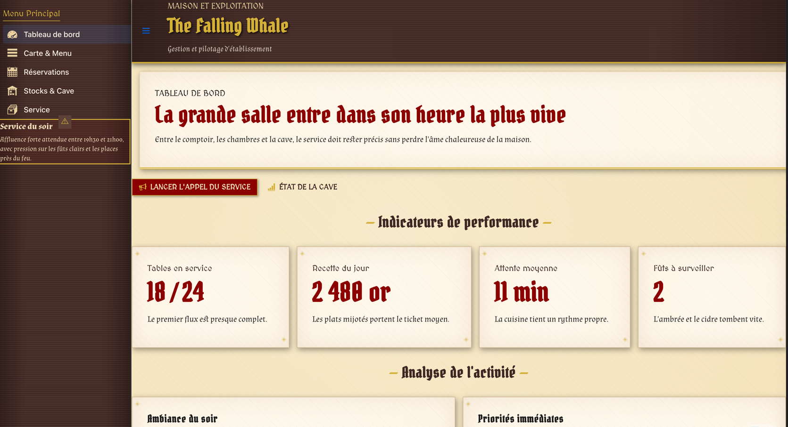
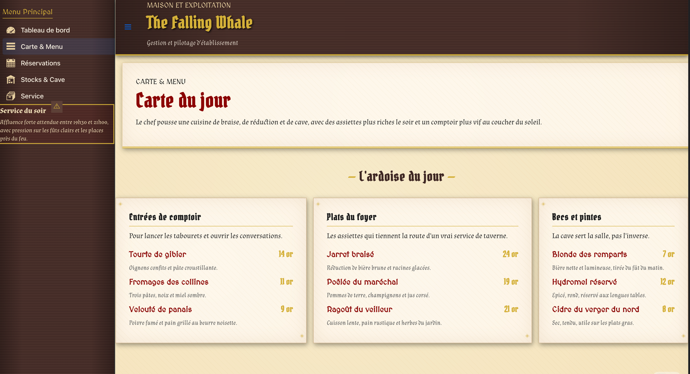
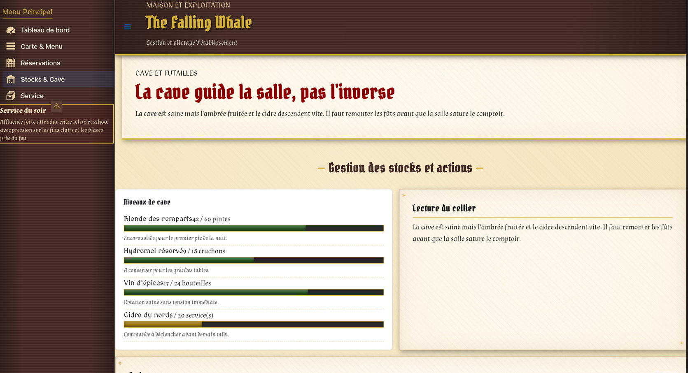

# Vaadin avec Quarkus

Ce sous-module montre une integration Vaadin Flow dans Quarkus avec un decoupage explicite entre vues, service et repository.

## Lancer le projet

```bash
./mvnw -pl web-concept/vaadin-tutorial quarkus:dev
```

Puis ouvrir `http://localhost:8080/`.

## Points cles

- `com.vaadin:vaadin-quarkus-extension` active l'integration officielle Vaadin pour Quarkus.
- Le servlet `AdminServlet` mappe Vaadin sur `/*` pour exposer l'application a la racine du module.
- Le package `view` contient uniquement l'assemblage UI Vaadin.
- `TavernService` orchestre les donnees exposees aux vues.
- `InMemoryTavernRepository` centralise les jeux de données de démonstration.
- Le rendu visuel est compose cote composants pour garder un exemple simple a executer dans Quarkus sans pipeline frontend additionnel.
- **Intégration JS (Bridge Java-JS) :** Démonstration de l'utilisation de bibliothèques gratuites (**Leaflet** pour la carte et **Chart.js** pour les graphiques) en remplacement des composants payants Vaadin Pro. Cela montre comment étendre Vaadin avec `getElement().executeJs()` et les annotations `@JavaScript`/`@StyleSheet`.

## Aperçu du Thème : "The Falling Whale"


L'application utilise désormais un thème **Médiéval Fantastique** personnalisé via CSS (Lumo bypass) :

- **Ambiance :** Textures de parchemin vieilli et bois sombre générées en CSS pur.
- **Typographie :** Polices thématiques importées via Google Fonts (Pirata One, MedievalSharp, Almendra).
- **Composants stylisés :**
  - **Grilles :** Transformées en registres de comptes anciens (Le Grand Livre).
  - **Stocks :** Indicateurs dynamiques avec couleurs de statut (Rouge Sang, Ambre, Vert Forêt).
  - **Modales :** Titres contrastés style manuscrit sur fond parchemin.
  - **Boutons :** Style "Sceau de Cire" et cuir.

### Captures d'écran (emplacements suggérés) :

> *Note : Comme je suis une IA en mode texte, vous devez ajouter vos propres captures d'écran dans le dossier `docs/` pour qu'elles s'affichent ci-dessous.*


*Le tableau de bord avec sa bannière pleine largeur et ses indicateurs.*


*La carte du jour avec les prix alignés et le style parchemin.*


*L'écran des stocks, aussi accessible en modal depuis le dashboard*
